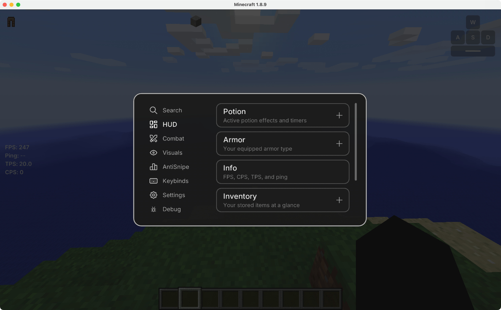
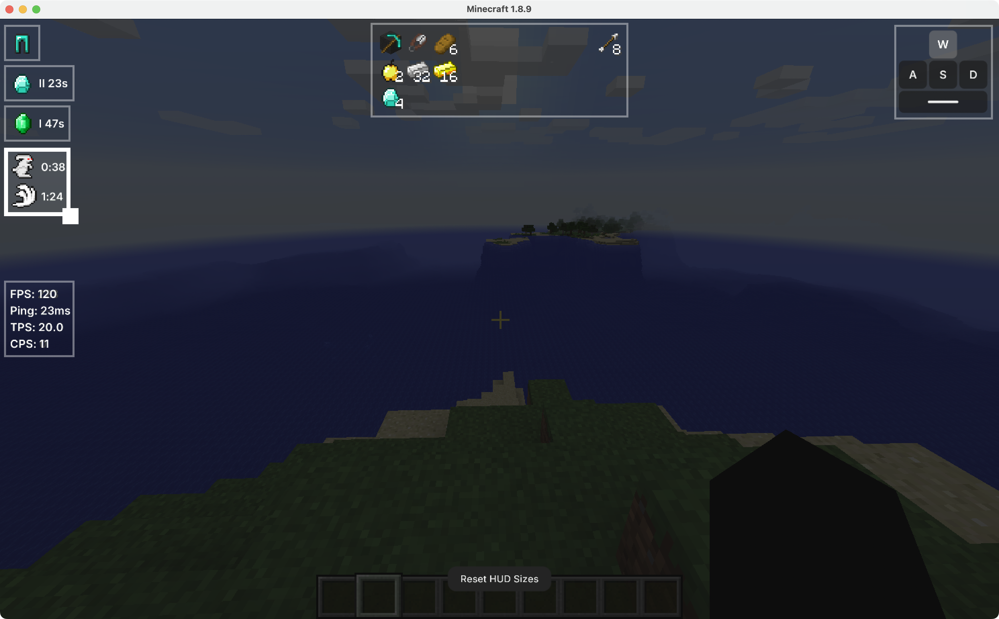

# Cobblify

A Hypixel BedWars quality-of-life mod for **Minecraft 1.8.9**, on **Forge** or **Lunar Client**, featuring several modules and a custom GUI.

Adheres to the [Hypixel Allowed Modifications](https://support.hypixel.net/hc/en-us/articles/6472550754962-Hypixel-Allowed-Modifications)
policy — no automation of player actions, no unfair advantages.

## Install

### Forge

1. Have a **Minecraft Forge 1.8.9** instance
2. Download the latest **`Cobblify-1.8.9-forge-<version>.jar`** from the
   [**Releases**](../../releases/latest) page.
3. Drop it into your instance's `mods/` folder.
4. Launch the game. Press **Right Shift** (or run `/cobblify`) to open the settings (bind can be changed in minecraft settings).

### Lunar Client

1. Download the **`Cobblify-Lunar-<version>`** bundle for your OS from the [**Releases**](../../releases) page (look for the latest `lunar-` release) and unzip it.
2. Double-click the installer (**`Install BedwarsQOL (Lunar).command`** on Mac, **`.bat`** on Windows). It copies the Weave loader + mod into place and prints a `-javaagent:` line.
3. In Lunar: Settings → turn on **Advanced Mode** → paste that line into **JVM Arguments** → save, pick **1.8.9**, and Play. Press **Right Shift** (or run `/cobblify`) in-game to open the settings.

**NOTE:** Stats and AntiSnipe need a one-time backend setup — see below (~5 minutes).

## Optional: enable Hypixel stats

Hypixel stats are served by a tiny **Cloudflare Worker you self-host** (free, private). Use the installer.

1. Run the installer for your OS (clone/download this repo, or get it from [**Releases**](../../releases/latest)):
   - **Windows:** double-click [`installers/setup-windows.bat`](installers/setup-windows.bat)
   - **Mac:** double-click [`installers/setup-mac.command`](installers/setup-mac.command)

2. Follow the prompts. A browser opens to log in or sign up for Cloudflare (free). If Cloudflare asks you to register a `workers.dev` name, type anything (e.g. your Minecraft name). The script deploys the Worker, locks it with a private token, and prints two chat commands (the first is copied to your clipboard).

3. In Minecraft, paste both commands into chat (`/cobblify statsurl ...` and `/cobblify statstoken ...`), then enable **Hypixel Stats** in the mod GUI (Right Shift).

That's it.

**Optional - Urchin cheater tags:** get a free API key from the Urchin Discord bot (`/grant`), then run `/cobblify urchinkey <your key>` in chat. Your key stays on your own Worker; the mod never holds it.

## Features: Cobblify — Features

### HUD (draggable/resizable)
  - **Potion** - active potion effects + timers
  - **Armor** - your equipped armor
  - **Inventory** - your stored items at a glance
  - **Gen Timers** - diamond/emerald spawn countdowns
  - **Keystrokes** - WASD + spacebar display
  
  **NOTE** - most HUD modules have an "In Game Only" option = show only during a BedWars game

### Combat
  - **Hand Position** - move/resize your held item (X / Y / Z / Scale)
  - **TNT Countdown** - fuse timer over nearby TNT (adjustable radius)
  - **Disable Esc Menu** - stop Esc opening the pause menu mid-combat

### Visuals
  - **Block Overlay** - highlight the block you look at (style / color / opacity / see-through)
  - **Tab Numeric Ping** - show latency as "123ms" instead of signal bars
  - **Hide Tab Header/Footer** - hide the server's tab header/footer text
  - **Tab + Scoreboard size scaling** - in setting

### AntiSnipe (opponent intel — needs the stats backend)
  - **Hypixel Stats** - opponents' BedWars stats on nametag + tab (level, rank, FKDR, WLR)
  - **Party Report** - announce flagged/sweaty enemies to party chat once per game

### Other
  - **Auto GG** - say "gg" in chat once each time a BedWars game ends
  - Practice/Debug : spawn clientside practice dummies
  - Custom settings GUI (Right Shift or /cobblify), GUI scale + color themes


## Showcase

### GUI


### HUD Editor


## Build from source (for developers)

Requires JDK 21 (Temurin recommended) for Gradle.

**Forge:**

```sh
./gradlew build
```

Output: `versions/1.8.9-forge/build/libs/Cobblify-1.8.9-forge-<version>.jar`
(the remapped production jar; ignore the `-dev.jar`, which is for the `runClient` dev environment).

**Lunar Client (Weave):**

```sh
cd lunar && ./gradlew build
```

Output: `lunar/build/libs/Cobblify-Lunar-<version>.jar`.

## Credits

- [Tabler Icons](https://tabler.io/icons) (MIT) — settings nav icons.
- [Inter](https://rsms.me/inter/) (SIL OFL) — UI font.

## License

MIT — see [LICENSE](./LICENSE).
